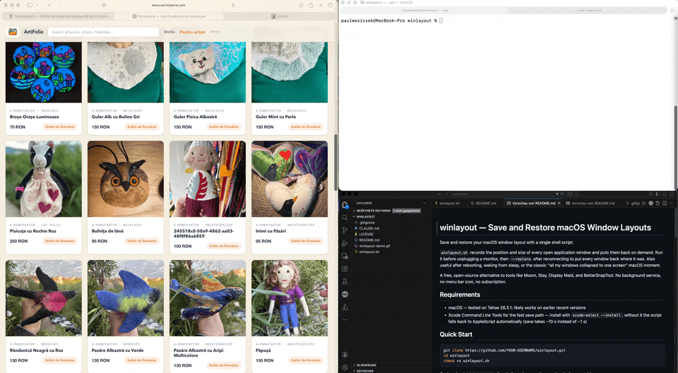

# winlayout — Save and Restore macOS Window Layouts

Save and restore your macOS window layout with a single shell script.



`winlayout.sh` records the position and size of every open application window and puts them back on demand. Run it before unplugging a monitor, then `--restore` after reconnecting to put every window back where it was. Also useful after rebooting, waking from sleep, or the classic "all my windows collapsed to one screen" macOS moment.

A free, open-source alternative to tools like Moom, Stay, Display Maid, and BetterSnapTool. No background service, no menu bar icon, no subscription.

## Requirements

- macOS — tested on Tahoe 26.3.1; likely works on earlier recent versions
- Xcode Command Line Tools for the fast save path — install with `xcode-select --install`; without it the script falls back to AppleScript automatically (save takes ~10 s instead of ~1 s)

## Quick Start

```bash
git clone https://github.com/YOUR-USERNAME/winlayout.git
cd winlayout
chmod +x winlayout.sh
```

Or download `winlayout.sh` directly from the repository and make it executable:

```bash
chmod +x winlayout.sh
```

**Save** the current layout:

```bash
./winlayout.sh
```

**Restore** it:

```bash
./winlayout.sh --restore
```

All three flags are equivalent:

```bash
./winlayout.sh --restore
./winlayout.sh -r
./winlayout.sh -restore
```

Layout is saved to `~/.window-layout.txt`.

**Optional — make it available system-wide:**

```bash
mkdir -p ~/bin && cp winlayout.sh ~/bin/winlayout
# If ~/bin is not on your PATH, add to ~/.zshrc: export PATH="$HOME/bin:$PATH"
```

## Permissions

macOS will usually prompt for the required permissions on first use. If windows are not moving, open **System Settings → Privacy & Security** and check:

| Permission | Required for | Grant to |
|---|---|---|
| Accessibility | Restore — moving windows | Your terminal app |
| Automation | Restore — finding apps via System Events | Your terminal app |
| Screen Recording | Optional — saving window titles | Your terminal app |

Screen Recording is not required. Without it, windows are matched by their saved order within each app rather than by title, which works well in most cases.

Restart your terminal after changing any permission.

## Automate with Shortcuts

The fastest way to restore your layout without opening a terminal is a keyboard shortcut in the macOS **Shortcuts** app:

1. Open **Shortcuts** and create a new shortcut.
2. Add a **Run Shell Script** action, set the shell to `/bin/zsh`, and enter:
   ```
   /full/path/to/winlayout.sh -r
   ```
3. Open the shortcut settings and assign a keyboard shortcut.

Press the key and all windows snap back to their saved positions.

A nice touch: the Apple Extended Keyboard has dedicated function keys (F13–F19) that no app uses by default — assigning restore to **F19** gives you a one-key shortcut with zero chance of conflicts.

To also save from a shortcut, create a second one without `--restore`.

## How It Works

**Save** queries all visible windows from the macOS window server in a single CoreGraphics call — completes in under one second. The fallback AppleScript path, used when Swift is unavailable, queries each running app individually and takes around ten seconds.

**Restore** uses the macOS Accessibility API to match each saved record to a live window and set its position and size. Windows are matched by title first. For apps with dynamic titles (Terminal, code editors) or when Screen Recording is not granted, windows are matched by their saved position within that app's window list.

Each window is stored as one tab-delimited line:

```
AppName    WindowTitle    x    y    width    height
```

## Limitations

- Not a snapping or tiling tool; does not create zones or keyboard-driven resize presets.
- Works best when the same apps and windows are open at restore time; apps that are not running are skipped.
- Cannot move windows that an app or macOS blocks through the Accessibility API.
- Coordinates are specific to a display arrangement. Re-save when you change your monitor setup.

## Troubleshooting

**Some windows are not restored at all and stay in their current position.**  
This happens occasionally — some windows are not reachable during a restore pass. Running the restore command 1–3 times is usually enough to catch them all.

**Nothing moves when I restore.**  
Check Accessibility and Automation permissions for your terminal app, then restart it.

**Some windows move but others do not.**  
The app may not expose its windows through Accessibility. Confirm the app is running and has at least one visible window.

**Windows end up on the wrong monitor.**  
Save the layout with the exact monitor arrangement you want to restore to.

**Window titles are empty in `~/.window-layout.txt`.**  
Grant Screen Recording permission to your terminal. The script still works without it.

**Permission prompts appear every time.**  
Grant permissions permanently in System Settings rather than dismissing the prompt each time.

## License

[The Unlicense](LICENSE) — public domain, no conditions.
